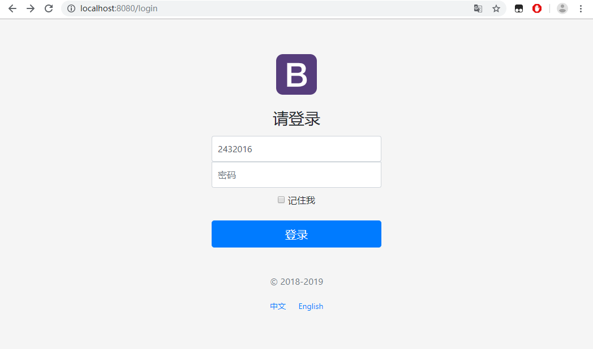
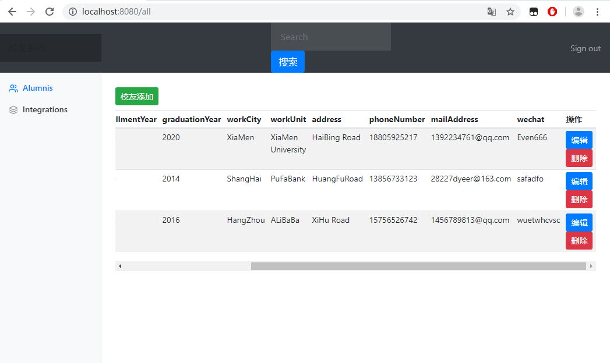
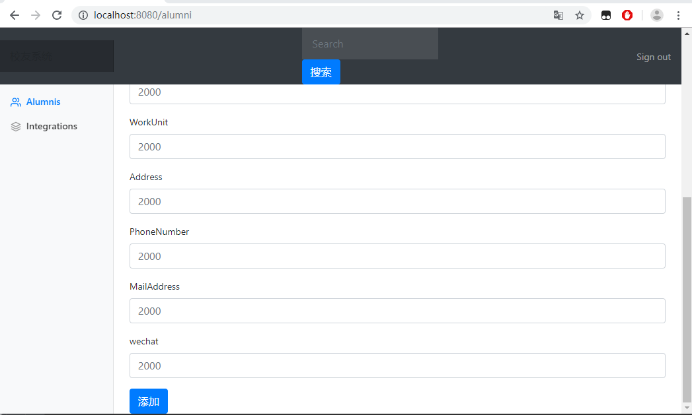
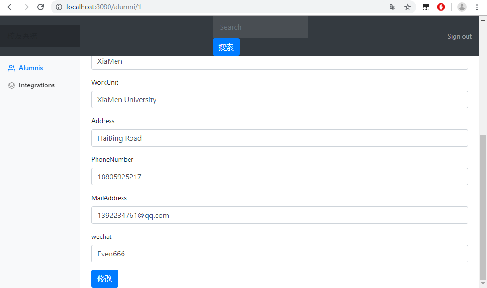
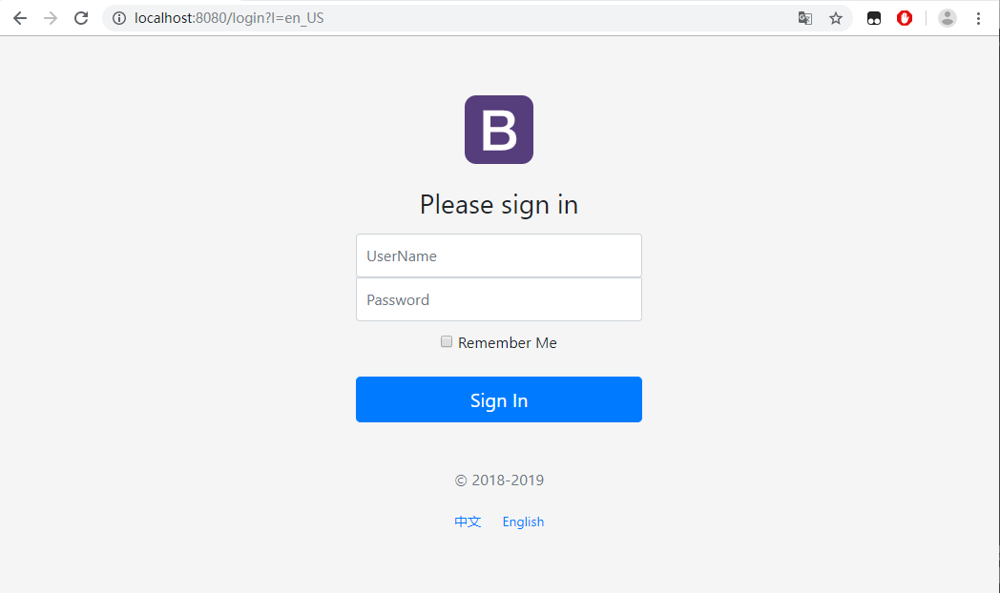

# <center>实验六：Web服务调用</center>

### 一、实验准备
+ 下载或安装java jdk （1.6或者以上）；

+ 熟悉IDEA 或者 eclipse 等开发环境；

+ 查看并运行web服务编程的例子（具体见第10章的课堂代码 ）；

+ 部署Mysql数据库服务器，查看并运行Mybatis的例子；

### 二、实验目标

+ 理解web Service和SOA架构，构建web服务。

+ 要求：

    基于RESTful样式，实现校友信息管理系统，对校友目录进行的插入、检索、修改、删除、统计等功能；同时，后端数据库使用Mybatis或者Hibernate进行操作。

### 三、实验内容

#### 1、登录

+ 功能详述：
&nbsp;&nbsp;&nbsp;&nbsp; 在登录界面，输入不为空的用户名和123456的密码即可登录。若登录成功，则跳转到主页面；若登录失败，则跳回登录界面，重新登录，并显示错误信息。进入主页面需要先登录，未登录直接进入主页面会自动跳转到登录页面，并显示错误信息。

+ 编写login.html的表单内容以及表单提交的路径

+ 编写LoginController.java，处理登录表单

```java
package com.controller;

import com.mapper.ManagerMapper;
import org.springframework.beans.factory.annotation.Autowired;
import org.springframework.stereotype.Controller;
import org.springframework.util.StringUtils;
import org.springframework.web.bind.annotation.RequestMapping;
import org.springframework.web.bind.annotation.RequestMethod;
import org.springframework.web.bind.annotation.RequestParam;

import javax.servlet.http.HttpSession;
import java.util.Map;

/**
 * @Author: EvenHuang
 * @Date: 2019/6/19 15:53
 */
@Controller
public class LoginController {

    @Autowired
    ManagerMapper managerMapper;

     @RequestMapping(value = "/login",method = RequestMethod.POST)
     public String login(@RequestParam("username") String username, @RequestParam("password") String password, Map<String, Object> map, HttpSession session) {
         String target=null;
         if(!StringUtils.isEmpty(username)){
             target=managerMapper.getManager(username).getPassword();
             if (target.equals(password)) {
                 //登录成功
                 session.setAttribute("username",username);
                 return "redirect:/main";
             }
             else {
                 //登录失败
                 map.put("msg", "用户名或密码错误");
                 return "login";
             }
         }
         else {
             //登录失败
            map.put("msg", "用户名或密码错误");
                return "login";
         }
     }

     @RequestMapping(value = "/main")
     public String main(){
         return "dashboard";
     }

     @RequestMapping(value = "/login",method = RequestMethod.GET)
     public String login(){
         return "login";
     }
}
```
+ 编写拦截器，对请求进行拦截（只有以登录的用户才可以进入主页面）
```java
package com.component;

/**
 * @Author: EvenHuang
 * @Date: 2019/6/19 19:53
 */
import com.entity.Alumni;
import org.springframework.web.servlet.HandlerInterceptor;
import org.springframework.web.servlet.ModelAndView;

import javax.servlet.http.HttpServletRequest;
import javax.servlet.http.HttpServletResponse;

/**
 * 登录检查
 */
public class LoginHandlerInterceptor implements HandlerInterceptor {

    @Override
    public boolean preHandle(HttpServletRequest request, HttpServletResponse response, Object handler) throws Exception {
        Object user =  request.getSession().getAttribute("username");
        if (user == null) {
            //未登录，返回登录页面
            request.setAttribute("msg", "没有权限，请先登录");
            request.getRequestDispatcher("/login").forward(request, response);
            return false;
        } else {
            //已登录
            return true;
        }
    }

    @Override
    public void postHandle(HttpServletRequest request, HttpServletResponse response, Object handler, ModelAndView modelAndView) throws Exception {

    }

    @Override
    public void afterCompletion(HttpServletRequest request, HttpServletResponse response, Object handler, Exception ex) throws Exception {

    }
}
```

+ 运行结果


#### 2、校友的增删改查

+ 功能详述：
  1. CRUD满足Rest风格
  2. URI：/资源名称/资源标识
  3. 根据HTTP请求区别CRUD操作

+ 请求架构

|   请求URI    | 请求方式 |             功能             |
|:------------:|:--------:|:----------------------------:|
|     /all     |   GET    |         查询所有校友         |
| /alumni/{id} |   GET    | 查询某个校友（来到修改页面） |
|   /alumni    |   GET    |         来到添加页面         |
|   /alumni    |   POST   |           添加校友           |
| /alumni/{id} |   GET    |         来到修改页面         |
|   /alumni    |   PUT    |         修改校友信息         |
| /alumni/{id} |  DELETE  |           删除校友           |

+ 查询所有校友

  1. 编写list.html，将校友信息以表格信息显示出来

  2. 在主页面编写校友列表的请求路径（因为已将公共元素抽取到bar.html中，所有应到其进行修改）

  3. 编写相应的Controller出来该请求
  ```java
  @RequestMapping(value = "/all")
      public String list(HttpServletRequest request){
          String token=null;
          try{
              token=request.getParameter("token");
          }catch(Exception e){
              e.printStackTrace();
          }
          ArrayList<Alumni> alumnis;
          if(token == null || token.length() <= 0){
              alumnis = alumniMapper.selectAlumnis();
          }
          else if(token.equals("sousuo")){
              String key=request.getParameter("key");
              alumnis=alumniMapper.selectAlumnisByName(key);
          }
          else
              alumnis = null;
          for (Alumni alumni : alumnis) {
              System.out.println("校友：" + alumni.toString());
          }
          request.setAttribute("alumnis", alumnis);

          return "operate/list";
      }
    ```

    4. 运行结果
    

+ 添加校友
  1. 在list.html编写请求路径

  2. 编写OperateController处理该请求
  ```java
   //添加新校友
      @RequestMapping(value = "/alumni",method = RequestMethod.POST)
      public String add(Alumni alumni){
          alumniMapper.addAlumni(alumni);

          return "redirect:/all";
      }
  ```

  3. 编写edit.html的表单

  4. 再次编写OperateController处理该表单
  ```java
  //添加新校友
      @RequestMapping(value = "/alumni",method = RequestMethod.POST)
      public String add(Alumni alumni){
          alumniMapper.addAlumni(alumni);

          return "redirect:/all";
      }
  ```

  5. 运行结果
  

+ 校友信息编辑
  1. 在list.html编写请求路径

  2. 编写OperateController处理该请求
  ```java
    //来到校友信息修改页面，查出指定校友信息，在页面上显示
    @RequestMapping(value = "/alumni/{id}",method = RequestMethod.GET)
    public String edit(@PathVariable("id")String id,Model model){
        Alumni alumni=alumniMapper.selectAlumniById(Integer.valueOf(id));
        model.addAttribute("alumni",alumni);

        return "/operate/edit";
    }
  ```

  3. 在edit.html进行信息回显，并将修改后的信息以表单提交

  4. 再次编写OperateController处理该表单（修改校友信息后，浏览器跳回校友列表）
  ```java
  //修改校友信息
      @RequestMapping(value = "/alumni",method = RequestMethod.PUT)
      public String update(Alumni alumni){
          alumniMapper.updateAlumni(alumni);

          return "redirect:/all";
      }
  ```

  5. 运行结果
  

+ 删除校友
  1. 在list.html编写删除功能
  ```html
  <script>
      $(".deleteBtn").click(function () {
          //删除当前员工
          $("#deleteEmpForm").attr("action",$(this).attr("del_uri")).submit();
      })
  </script>
  ```

  2. 编写OperateController处理该请求
  ```java
  //删除好友
      @RequestMapping(value = "/alumni/{id}",method = RequestMethod.DELETE)
      public String deleteAlumni(@PathVariable String id){
          alumniMapper.deleteAlumniById(Integer.valueOf(Integer.valueOf(id)));

          return "redirect:/all";
      }
  ```

  3. 运行结果
  

+ 附加功能：国际化
  1. 首先，编写国际化的配置文件，抽取页面需要显示的国际化信息（login.properties是默认的国际化配置文件，login_en_US.properties是--美国的配置文件，login_zh_CN是中国的配置文件）
      - login.properties
        ```java
          login.btn=登录
          login.password=密码
          login.remember=记住我
          login.tip=请登录
          login.username=用户名
        ```

      - login_en_US.properties
        ```java
            login.btn=Sign In
            login.password=Password
            login.remember=Remember Me
            login.tip=Please sign in
            login.username=UserName

      - login_zh_CN
        ```java
            login.btn=登录
            login.password=密码
            login.remember=记住我
            login.tip=请登录
            login.username=用户名
          ```

  2. 其次，自定义国际化，在application.properties进行配置

  3. 接着，编写LocaleResolver（获取区域信息对象）
  ```java
    package com.component;

    /**
     * @Author: EvenHuang
     * @Date: 2019/6/19 19:51
     */
    import org.springframework.util.StringUtils;
    import org.springframework.web.servlet.LocaleResolver;

    import javax.servlet.http.HttpServletRequest;
    import javax.servlet.http.HttpServletResponse;
    import java.util.Locale;

    /**
     * 可以在连接上携带区域信息
     */
    public class MyLocalResolver implements LocaleResolver {

        @Override
        public Locale resolveLocale(HttpServletRequest request) {
            String l = request.getParameter("l");
            Locale locale = Locale.getDefault();
            if (!StringUtils.isEmpty(l)) {
                String[] strings = l.split("_");
                locale = new Locale(strings[0], strings[1]);
            }
            return locale;
        }

        @Override
        public void setLocale(HttpServletRequest httpServletRequest, HttpServletResponse httpServletResponse, Locale locale) {

        }
    }
  ```

  4. 编写配置类，将组件注册到容器中

  5. 在login.html切换语言处修改链接
  ```html
  <a class="btn btn-sm" th:href="@{/login(l='zh_CN')}">中文</a>
  <a class="btn btn-sm" th:href="@{/login(l='en_US')}">English</a>
  ```

  6. 运行结果
  

### 四、实验总结与分析
1、实验遇到的问题
&nbsp;&nbsp;&nbsp;&nbsp; 可能是浏览器渲染的原因，每次运行界面不太一样,从多次试验结果来看，可能跟浏览器负载有关系————当只打开一个界面时最接近预期效果。
